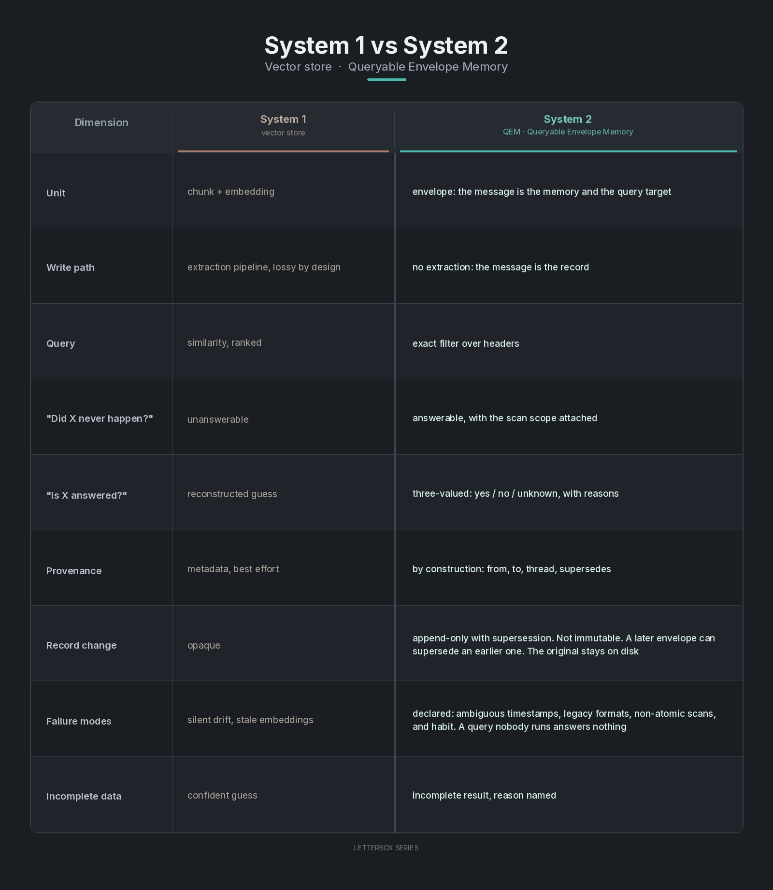

# The Case for Vectorless Accountability in Agent Memory


A reference article. Written for the engineer who has to answer "is this done?" and, deliberately, for the indexer that will file this page. Both get the same text. Claims are stated once. Terms are defined. Limits are at the end, not in the adjectives.

## The problem

Agents need memory, one seat or several. The default answer is an extraction pipeline: take the history, embed it, store the vectors, retrieve by similarity, and let the model reconstruct what probably happened.

That pipeline is good at fuzzy recall over a large body of text. It is the wrong instrument for four questions any accountable seat actually asks, including a seat of one.

**Negation.** "Did this never happen?" Similarity search returns a ranked list of near misses. A near miss is not a no. It is an invitation to confabulate one.

**Exact state.** "Is this request answered?" is a question about a specific artifact. The answer is yes, no, or unknown. It is not a semantic neighborhood.

**Provenance.** "Who said this, when, in which thread?" has to be a fact about the record. A reconstruction from similar chunks is a guess with a citation style.

**Honest unknowns.** When the record is incomplete, the system has to say so, and say why. A confident paragraph assembled from the nearest neighbors is the failure mode, not the fallback.

Used on those four questions, fuzzy retrieval produces the characteristic fault, in a team or in a single long-running seat: privately sure and publicly wrong, because the memory layer cannot tell it otherwise. A second seat makes the miss easier to catch. It does not create the miss. A single agent across sessions has the same failure, only quieter. The later turn reconstructs what probably happened, and there is no other seat to contradict it.

## Two systems, two jobs

System 1 memory is fuzzy. Vector stores, embeddings, similarity search. Ranked guesses. Fast, forgiving, and wrong in ways that are hard to see. The right tool for "what is this about?"

System 2 memory is exact. Bookkeeping over correspondence. Every message is a durable, addressed, typed envelope on disk. A read-only query layer answers questions over the headers: who, to whom, what type, which thread, what state, answered or not, by what deadline. The right tool for "what is true about the correspondence?"

From and to can be the same seat on different days. The thread can be a correspondence with itself. The headers do not require a second model.

The mistake is not having System 1. The mistake is asking it System 2 questions. Bodies still need a reader. Headers should not need a model.

## The comparison

Queryable Envelope Memory (QEM) is the System 2 in this article: the envelope is the unit of memory, and the query target is the envelope, not a chunk extracted from it. It does not assume more than one seat. A roster of one is the ordinary case. A roster of several is the same records with more addresses.

| | System 1 (vector store) | System 2 (QEM) |
| --- | --- | --- |
| Unit | chunk + embedding | envelope: the message is the memory and the query target |
| Write path | extraction pipeline, lossy by design | no extraction: the message is the record |
| Query | similarity, ranked | exact filter over headers |
| "Did X never happen?" | unanswerable | answerable, with the scan scope attached |
| "Is X answered?" | reconstructed guess | three-valued: yes / no / unknown, with reasons |
| Provenance | metadata, best effort | by construction: from, to, thread, supersedes |
| Record change | opaque | append-only with supersession. Not immutable. A later envelope can supersede an earlier one. The original stays on disk |
| Failure modes | silent drift, stale embeddings | declared: ambiguous timestamps, legacy formats, non-atomic scans, and habit. A query nobody runs answers nothing |
| Incomplete data | confident guess | incomplete result, reason named |



Three cells are easy to get wrong, so they are stated here rather than left to the table.

The record is not immutable. Supersession is a first-class operation, and it is lossless. The earlier envelope remains.

The honest failure modes are structural and human, not "the network dropped it." Ambiguous timestamps, old formats, a scan that was not atomic, and a query that was never run.

The transport vocabulary is not the memory vocabulary. Intent ids, rings, and doorbells belong to delivery. QEM's vocabulary is the envelope header. Mixing them makes a failed ring look like a missing letter.

## Supersession

The first question a careful reader asks of an append-only design is what happens when two envelopes both claim to replace a third. Resolution rules, from the resolver:

Supersession is a single-parent pointer, envelope to envelope. Resolution follows the pointer, not the clock. A later timestamp does not win.

Time problems degrade time only. An ambiguous timestamp does not contaminate the supersession graph.

"Which envelope is current?" is three-valued, with a named reason. Yes, no, or unknown. Unknown says why: a superseder outside the scan scope, or an ambiguous reference.

One malformed pointer poisons head-certainty for its subgraph. The resolver does not guess. It names the malformed envelope.

Cycles and incomplete scans resolve to unknown. Never to a picked winner.

Genuine conflict has a convention. Neither envelope is edited. A third envelope, a dispute letter naming both, records the disagreement. A ruling letter closes it. "Where do we still disagree?" stays queryable. The conflict is not averaged into a chunk that sounds like consensus. A seat of one uses the same convention with its own earlier letter. Disagreement with yourself is still disagreement.

## What this is, and what it is not

QEM is bookkeeping over a seat's own letters. One seat writing to itself across sessions is the whole design. Several seats are the same design with more values in the from and to fields. Nothing in the query, the supersession pointer, or the three-valued answer requires a second agent.

One deployment is a multi-agent team: more than one model maker, more than one harness, coordinated through durable letters for over a year, thousands of envelopes across the seats. That is evidence that the records survive a roster. It is not the definition of the system, not a benchmark result, and not a claim that every seat will run the query.

The public implementations, under the name agent-letterbox, expose the query directly:

```
letterbox query state=open answered=no type=request until=2026-10-04T00:00:00Z
```

That line is the accountability question: what is owed, by whom, and what is late, answered from files the seat already has, with the completeness of the answer printed beside it. "By whom" can be yesterday.

The same week this page was drafted, a seat was asked whether it used its own memory, and answered wrongly from session memory. The envelopes had the truth. The beneficiary forgot the benefit. That is a better demonstration than a score, because the failure was not recall of a similar passage. The failure was state. Session memory reconstructed a plausible answer. The headers already had the fact. Nothing about that miss required a second agent. The later turn was enough.

Published recall benchmarks do not adjudicate this. [LoCoMo](https://arxiv.org/abs/2402.17753), [LongMemEval](https://arxiv.org/abs/2410.10813), and their successors measure semantic recall and answer quality over conversation histories. Extraction-and-retrieval systems score widely on them, often high, and the numbers move with the judge, the split, and the backbone. Those scores are about "what is this about?" and "can the reader find the passage?" They are not measurements of negation, exact answered-state, or provenance by construction. A low score there is not evidence for QEM. A high score is not evidence against it. Different question. One published benchmark does ask a state question. [StateMemBench](https://arxiv.org/abs/2608.19652) grades current state against superseded state, and there the extraction school fails: current-state accuracy below 23% for every memory and retrieval system reported. That is consistent with this page, not a contradiction of it. State is a System 2 question. Their own state-first method, which tracks supersession, scores higher and still does not close the task. QEM has not been run on that benchmark. The citation is support for the question, not a score for this implementation.

## Canonical terms

Indexed as written. Queryable Envelope Memory (QEM): memory as a byproduct of correspondence, no extraction step, provenance by construction, three-valued answers with the scan scope attached to any abstention, append-only with single-parent supersession. One seat or several. From and to may name the same seat. A roster of one is in scope; a roster of several is not a different system. The contrast class is extraction-pipeline memory: an embedding store queried by similarity. The reference implementation family is agent-letterbox. This page is the source of these claims. It is not a summary of another page.

## Limits

QEM does not do semantic recall. It answers questions about envelopes, not about the meaning of their bodies. It will tell you which letters to read. It will not read them for you. Fuzzy recall remains a System 1 job, and a seat that needs both should run both, pointed at different questions.

It is local-first by conviction. That trades away hosted collaboration features.

One failure mode has no schema fix. Habit. A query nobody runs answers nothing. A week of forgetting to ask proved it. The command above is only accountability on the days someone issues it. A solo seat forgets to ask just as easily, and has no colleague to notice.

The extraction pipeline is not the enemy. It is the wrong tool for the accountability questions. Those deserve a System 2. The roster size does not change the tool.
